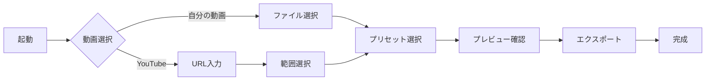

# ユーザーフロー仕様書

## 概要

本ドキュメントは、「5分で完成」を実現する具体的なユーザーフローを定義します。各フローは最大3つの主要ステップで構成され、サブステップも含めて直感的な操作を実現します。

## 1. メインフロー図



## 2. 詳細フロー仕様

### 2.1 初回起動フロー（30秒）

#### 画面: スプラッシュ → ホーム
```
1. アプリアイコンタップ
2. スプラッシュ表示（1秒）
   - ロゴアニメーション
   - プリロード開始
3. ホーム画面表示
   - 2つの大きなボタン
   - 最近の作品（2回目以降）
```

**技術要件**
- スプラッシュ中にFFmpeg.wasm初期化
- 頻出アセットのプリキャッシュ
- 前回の設定を復元

### 2.2 自分の動画から作成フロー（2分）

#### ステップ1: 動画選択（15秒）
```
画面: ファイルピッカー
├─ カメラロール自動表示
├─ サムネイル大きめ表示
└─ 最新順ソート

操作:
- タップで選択
- 自動的に次へ遷移
```

#### ステップ2: 自動編集（45秒）
```
画面: プリセット選択
┌─────────────────────────┐
│  [動画プレビュー]       │
│  ■ 再生中...           │
│                         │
│  ◉ トレンド            │
│  ○ スタイリッシュ      │
│  ○ キュート            │
│                         │
│  [詳細設定 ▶]          │
└─────────────────────────┘

自動処理:
- 9:16に自動クロップ
- 顔認識で最適位置
- 60秒に自動カット
```

#### ステップ3: 微調整（30秒）※オプション
```
画面: クイック編集
- テキスト追加（ワンタップ）
- フィルター変更（スワイプ）
- 音楽追加（候補から選択）
```

#### ステップ4: エクスポート（30秒）
```
画面: 処理中
- リアルタイムプログレス
- 完了予測時間
- バックグラウンド処理対応
```

### 2.3 YouTube動画から作成フロー（3分）

#### ステップ1: URL入力（20秒）
```
画面: URL入力
┌─────────────────────────┐
│  YouTubeのURLを入力     │
│  ┌───────────────────┐ │
│  │ https://youtu.be/│ │
│  └───────────────────┘ │
│                         │
│  [ペースト]            │
│                         │
│  最近の履歴:            │
│  • video1              │
│  • video2              │
└─────────────────────────┘

機能:
- クリップボード自動検出
- URL妥当性チェック
- サムネイルプレビュー
```

#### ステップ2: 範囲選択（40秒）
```
画面: タイムライン編集
┌─────────────────────────┐
│  [動画プレビュー]       │
│                         │
│  ━━━●━━━━━━━━━━━━      │
│  0:15 / 10:30          │
│                         │
│  開始: [00:15]         │
│  終了: [01:15]         │
│                         │
│  [ハイライト検出 🎯]    │
└─────────────────────────┘

機能:
- ドラッグで範囲選択
- 数値入力も可能
- AIハイライト提案
```

#### ステップ3以降: 自分の動画フローと同じ

### 2.4 テンプレートからの作成（1分）※Phase 2

```
画面: テンプレートギャラリー
- トレンドテンプレート
- カテゴリ別表示
- プレビュー付き
```

## 3. エラーケースと回復フロー

### 3.1 動画選択エラー
```
エラー: 非対応フォーマット
対応: 
- 明確なエラーメッセージ
- 対応フォーマット表示
- 変換サービスへの誘導
```

### 3.2 YouTube URL エラー
```
エラー: 無効なURL/非公開動画
対応:
- URLフォーマットヒント
- 最近の成功URLを表示
- 手動での動画検索オプション
```

### 3.3 処理エラー
```
エラー: メモリ不足/処理失敗
対応:
- 自動リトライ（3回まで）
- 品質を下げて再試行オプション
- 部分的な結果の保存
```

## 4. ショートカット機能

### 4.1 リピート作成
```
機能: 前回と同じ設定
- ホーム画面に「前回の設定で作成」
- ワンタップで設定復元
- 動画選択から開始
```

### 4.2 お気に入りテンプレート
```
機能: よく使う設定を保存
- 星マークでお気に入り登録
- ホーム画面からアクセス
- 名前付けて管理
```

### 4.3 ドラッグ&ドロップ（Web版）
```
機能: ファイルを直接ドロップ
- ブラウザ全体がドロップゾーン
- 複数ファイル対応
- 自動で編集画面へ
```

## 5. プログレッシブディスクロージャー

### 5.1 初心者モード（デフォルト）
- 選択肢を最小限に
- 自動設定を多用
- 詳細オプションは非表示

### 5.2 詳細モード（オプトイン）
```
アクセス方法:
- 設定から切り替え
- 「詳細設定」ボタン
- 3回以上使用で提案
```

### 5.3 段階的な機能解放
```
使用回数による解放:
- 1-5回: 基本機能のみ
- 6-10回: カスタムテキスト
- 11回以上: 全機能
```

## 6. パフォーマンス最適化フロー

### 6.1 先読み処理
```
動画選択時:
- サムネイル生成を先行
- メタデータ解析を並行
- 次画面の準備を開始
```

### 6.2 段階的処理
```
編集中:
- 低解像度でプレビュー
- 最終出力時にフル品質
- 見た目の体感速度向上
```

### 6.3 バックグラウンド処理
```
エクスポート中:
- アプリ切り替え可能
- 通知で完了をお知らせ
- 次の編集を開始可能
```

## 7. アナリティクス計測ポイント

### 7.1 ファネル分析
```
計測ポイント:
1. アプリ起動
2. 動画ソース選択
3. プリセット選択
4. カスタマイズ実行
5. エクスポート開始
6. エクスポート完了
7. シェア実行
```

### 7.2 時間計測
```
重要指標:
- 起動→完成までの総時間
- 各ステップの滞在時間
- エラーからの回復時間
```

### 7.3 操作計測
```
UI操作:
- タップ/クリック数
- やり直し回数
- ヘルプ参照回数
```

## 8. A/Bテスト計画

### 8.1 プリセット表示順
- A: 人気順
- B: 最新順
- C: パーソナライズ

### 8.2 デフォルト設定
- A: 30秒動画
- B: 60秒動画
- C: 15秒動画

### 8.3 CTAボタン文言
- A: 「完成！」
- B: 「エクスポート」
- C: 「保存してシェア」

## 9. 将来の拡張ポイント

### Phase 2
- バッチ編集フロー
- コラボレーション機能
- クラウド保存

### Phase 3
- AI自動編集
- リアルタイムプレビュー
- ライブ配信連携

## まとめ

このユーザーフロー設計により、**本当に5分以内で動画編集が完了する体験** を実現します。各ステップは直感的で、失敗してもすぐにリカバリーでき、使うほどに高速化していく設計となっています。